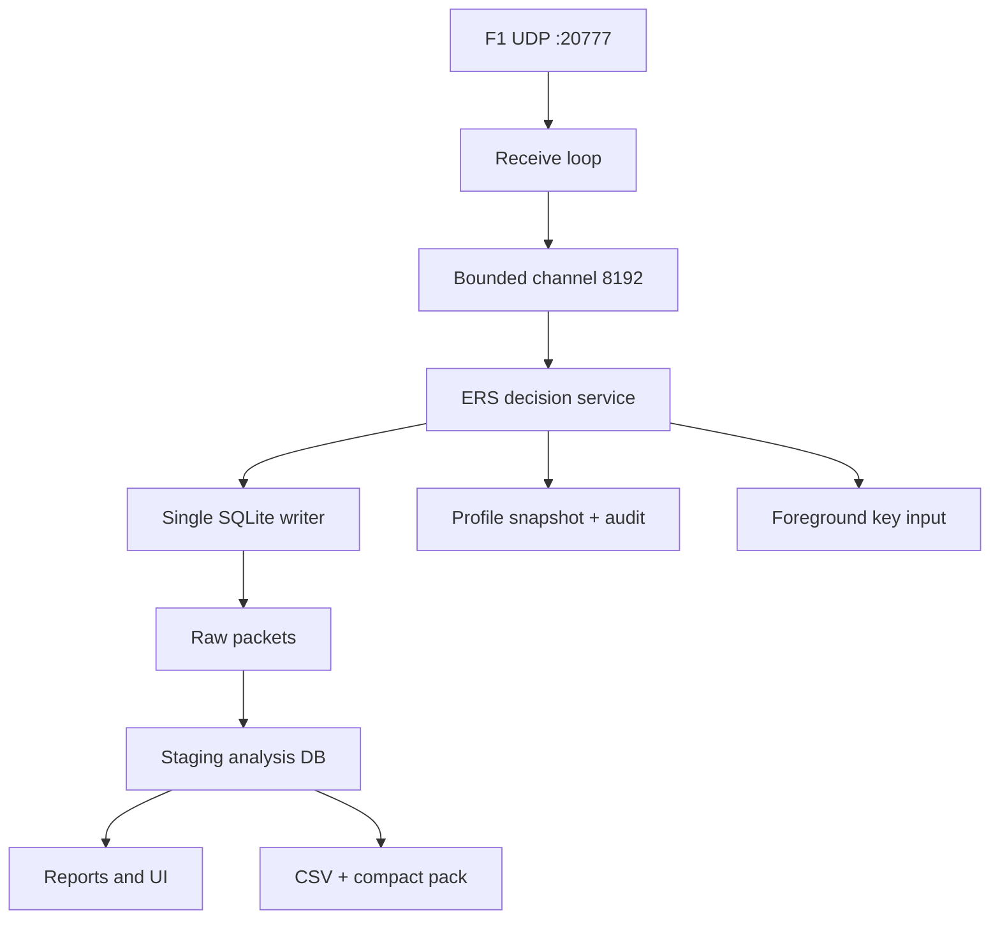
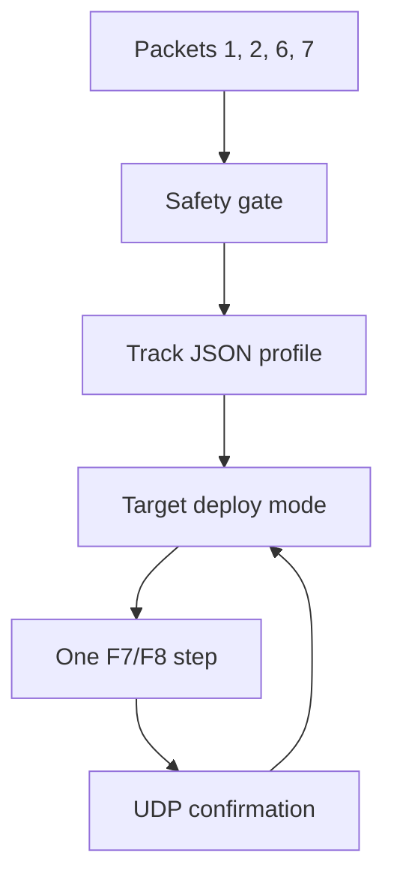
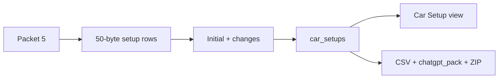

# Architecture

## Runtime pipeline

Receiver выполняет только проверку header, packet-aware quality counters и постановку неизменённого datagram в очередь. Один writer владеет SQLite connection. Stop закрывает receiver, дренирует channel, фиксирует metadata/quality, закрывает базу и только затем запускает анализ.

ERS service вызывается из того же последовательного consumer после извлечения пакета из очереди. Ошибка контроллера изолируется и не останавливает запись или сохранение raw UDP.

## ERS control pipeline

`ErsDecisionEngine` не зависит от Windows input и тестируется как чистый state machine. `ErsAutopilotService` соединяет parser, safety gate, выбранный профиль, feedback state и audit. `WindowsKeyboardErsInputSink` является единственным компонентом с Win32 `SendInput` и проверяет foreground process перед каждым нажатием.

Профиль выбирается по `track_id + session_type`. Внутренние `start_m/end_m` используются только как координаты триггеров; UI и audit показывают человекочитаемый `segment`. Порог восстановления имеет гистерезис. Правило `once_per_lap` резервирует активацию при входе и переносит активное wrap-around правило через линию старта без повторного запуска.

## Atomic analysis

1. `AnalysisEngine` создаёт SQLite backup исходной базы во временный файл рядом с ней.
2. Raw packets читаются вперёд-only reader, без загрузки всех payload в память.
3. Packet 0/2/5/6/7/10 содержит фиксированные массивы по 24 vehicle slots. Они всегда разбираются полностью: `m_numActiveCars` является количеством, а не верхней границей индекса, и online grid может иметь разрывы.
4. Parser строит нормализованные таблицы и индексы в staging DB.
5. `LapQualityAnalyzer` считает rewind подтверждённым только при official FLBK. Обратные счётчики без FLBK отделяют новую ветвь как `suspected_state_reset`, не загрязняя rewind-метрики.
6. SQL projection строит summary/trace/classification внутри staging DB.
7. После checkpoint успешный staging-файл атомарно заменяет `session.sqlite`.
8. CSV, analysis manifest и session manifest обновляются из подтверждённого результата.

Сбой до шага 7 оставляет исходную базу пригодной для повторного анализа.

## Car Setup pipeline

`next_front_wing_value` является packet-level значением игрока и сохраняется только для строки player car. Остальные поля принадлежат каждой активной машине.

## Quality model

| Dimension | Назначение |
|---|---|
| Capture | queue drops, invalid/unsupported packet headers и packet-aware sequence integrity |
| Session completeness | наличие начала/финиша, итогового packet 8 и достаточных данных |
| Analysis confidence | пригодность подтверждённых кругов и источников для отчётов |

Неизвестный cadence не превращается в нулевую потерю: `missing_frames_estimated = 0` имеет отдельный флаг рассчитанности.

## UI composition

Верхний shell содержит Live, Sessions, Analysis, Race и Settings. Выбранный `SessionListItem` является общим контекстом и запускает feature-level loaders. Analysis включает Lap Compare и Track Map с embedded detail. Race включает Overview, Car Setup, Driver Compare, Stints и Pits.

`MainWindow` пока остаётся code-behind shell. Сервисы parser, analysis, reports, settings, summaries, retention и setup не зависят от UI-контролов и тестируются отдельно.

## Ключевые инварианты

- Join никогда не опирается только на `frame_identifier`.
- Данные разных `session_uid` не соединяются.
- Official FLBK имеет приоритет над эвристикой.
- Finish reset не является rewind.
- Незавершённый круг не получает аналитическое время и не участвует в consumption aggregates.
- Track distance и corner labels используют одну геометрическую шкалу.
- `chatgpt_pack.sqlite` не содержит raw packets, но analysis ZIP также включает полный согласованный snapshot `session.sqlite`.
- ERS Live никогда не выполняется для online session или при включённом игровом ERS Assist.
- Каждая команда ERS является одним шагом и требует UDP-подтверждения перед следующим шагом.
- Overtake Mode 2026 не входит в ERS controller v0.9.0.
- Cleanup работает только внутри конкретной `<root>/telemetry_packs/`, только по preview и после подтверждения.

## Основные компоненты

| Компонент | Ответственность |
|---|---|
| `UdpRecorder` | UDP lifecycle, bounded queue, live state, packet-aware quality |
| `TelemetryDatabase` | schema v5, WAL, batching, raw persistence |
| `DatabaseSchemaMigrator` | идемпотентные `user_version` migrations |
| `F12026Parser` | bounds-checked packet format 2026, включая packet 5 |
| `LapQualityAnalyzer` | official flashback, finish completion и lap states |
| `AnalysisEngine` | streaming parse, staging DB и atomic replace |
| `AnalysisDerivedTableBuilder` | normalized projection и classification source |
| `CompareDataService` | reference traces and deltas |
| `RaceStrategyAnalyzer` | canonical stints and pit stops |
| `SessionSummaryService` | UI cards and global session context |
| `CarSetupDataService` | setup history for the selected driver |
| `ErsProfileStore` | seed, validation and deterministic selection of per-track profiles |
| `ErsDecisionEngine` | battery hysteresis, rule priority and per-lap activation state |
| `ErsAutopilotService` | packet state, safety blocks, feedback loop and audit |
| `WindowsKeyboardErsInputSink` | foreground-only F7/F8 injection and F12 emergency stop |
| `SessionPackager` | consistent full database, compact database and analysis ZIP |
