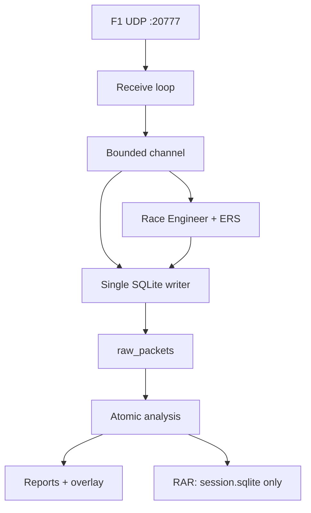
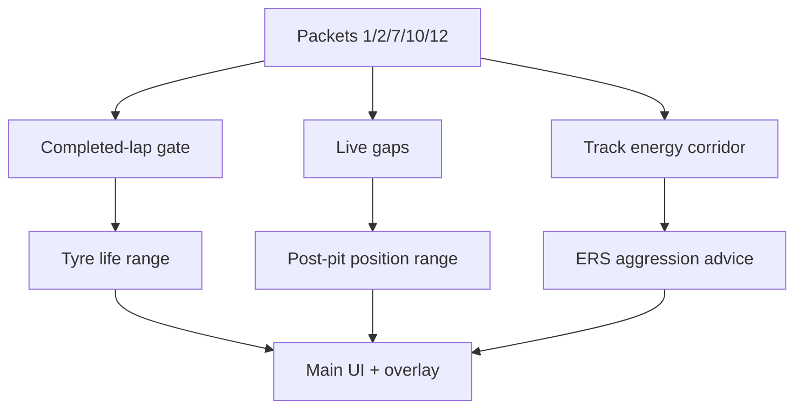
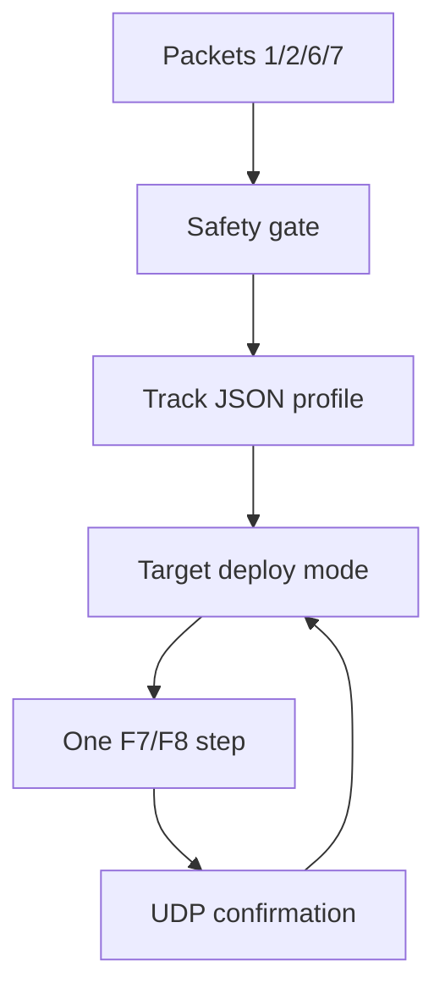

# Architecture

## Runtime pipeline



Receiver проверяет header, обновляет packet-aware quality counters и ставит неизменённый datagram в очередь. Один consumer последовательно обновляет Live Race Engineer, ERS controller и SQLite. Ошибка советника или ERS изолируется и не останавливает сохранение raw UDP.

Stop закрывает receiver, дренирует channel, фиксирует metadata и quality, закрывает рабочее соединение, запускает atomic analysis, обучение track model и только после этого создаёт RAR.

## Live Race Engineer



`RaceEngineerService` хранит только короткое live-состояние. Завершение круга подтверждается сменой `lap_num` и ненулевым `last_lap_time_ms`. Только завершённые clean non-pit non-SC laps становятся наблюдениями износа.

`RaceEngineerProfile` выбирается по `track_id + session_type`. Пользовательские профили лежат в `<root>/race_profiles`. Generic fallback имеет low confidence. `RaceProfileLearningService` после анализа обновляет средний износ по compound и green-flag pit loss. `session_uid` фиксируется в learned model, поэтому повторный анализ идемпотентен.

## ERS control pipeline



`ErsDecisionEngine` является чистой state machine. `ErsAutopilotService` соединяет parser, safety gate, track profile, feedback state и SQLite audit. `WindowsKeyboardErsInputSink` является единственным компонентом с Win32 `SendInput` и проверяет foreground process перед каждым нажатием.

Профиль выбирается по `track_id + session_type`. Внутренние `start_m/end_m` используются как координаты триггеров. UI и audit показывают подпись участка через повороты. Overtake Mode 2026 не автоматизируется.

## Atomic analysis

1. `AnalysisEngine` создаёт SQLite backup рабочей базы во временный файл рядом с ней.
2. Raw packets читаются forward-only reader без загрузки всех payload в память.
3. Фиксированные 24-slot массивы разбираются полностью, включая sparse online grid.
4. Parser строит нормализованные таблицы и индексы в staging DB.
5. Official FLBK отделяется от неподтверждённых reset-переходов.
6. SQL projection строит summary, trace и classification.
7. После checkpoint успешный staging-файл атомарно заменяет `session.sqlite`.
8. Результат анализа записывается в `analysis_runs` внутри той же базы.

Сбой до шага 7 оставляет исходную базу пригодной для повторного анализа. Автоматические CSV, JSON и compact database не создаются.

## RAR packaging

`SessionPackager` выполняет отдельный SQLite backup во временную папку, переводит journal в DELETE, делает `VACUUM`, запускает `PRAGMA integrity_check`, затем вызывает WinRAR:

```text
WinRAR.exe a -ma5 -m5 -md128m -ep -o+ -idq -y <archive>.rar session.sqlite
WinRAR.exe t -idq -y <archive>.rar
```

Рабочая директория WinRAR содержит только snapshot `session.sqlite`. ZIP fallback отсутствует. При ошибке test испорченный архив удаляется, рабочая база не меняется.

## UI composition

Верхний shell содержит Live, Sessions, Analysis, Race и Settings. Live дополнен четырьмя Race Engineer cards. `RaceEngineerOverlayWindow` является frameless transparent topmost window, которое получает тот же immutable snapshot.

Sessions позволяет вручную создать краткий XLSX. `RaceSummaryWorkbookExporter` читает только `session.sqlite` и создаёт листы Laps, Tyres, Pits, ERS и Quality. XLSX не входит в RAR.

## Ключевые инварианты

- Join никогда не опирается только на `frame_identifier`.
- Данные разных `session_uid` не соединяются.
- Raw UDP остаётся восстанавливаемым источником.
- Незавершённый круг не участвует в consumption или tyre-learning aggregates.
- Pit/invalid/SC laps не обучают tyre model.
- Приближённые значения имеют диапазон и confidence.
- ERS Live никогда не выполняется online или при включённом игровом ERS Assist.
- Каждая команда ERS является одним шагом и требует UDP-подтверждения.
- Новый RAR содержит ровно один файл: `session.sqlite`.
- Cleanup работает только внутри конкретной `<root>/telemetry_packs/`, после preview и подтверждения.

## Основные компоненты

| Компонент | Ответственность |
|---|---|
| `UdpRecorder` | UDP lifecycle, bounded queue, live services и safe stop |
| `F12026Parser` | структуры packet format 2026, включая Tyre Sets packet 12 |
| `AnalysisEngine` | streaming parse, staging DB и atomic replace |
| `RaceEngineerService` | live completed laps, tyre, pit и ERS advice |
| `RaceEngineerProfileStore` | базовые и learned track profiles |
| `RaceProfileLearningService` | идемпотентное обучение после анализа |
| `ErsAutopilotService` | safety blocks, feedback loop и audit |
| `TelemetryDatabase` | raw, live audit, snapshots и metadata |
| `RaceEngineerOverlayWindow` | topmost live overlay |
| `RaceSummaryWorkbookExporter` | ручной краткий XLSX |
| `SessionPackager` | verified maximum-compression RAR5 |
