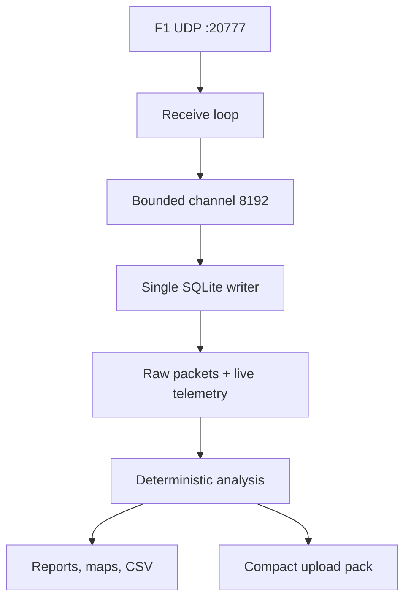

# Architecture

## Runtime pipeline

Receiver выполняет только проверку header, подсчёт качества и постановку неизменённого datagram в очередь. Один writer владеет SQLite connection, поэтому конкурентных записей в базу нет. Stop сначала останавливает receiver, затем закрывает channel, ожидает writer, фиксирует quality/metadata и только после этого запускает анализ.

## Analysis pipeline

1. `AnalysisEngine` заново декодирует поддерживаемые raw packets.
2. `LapQualityAnalyzer` определяет активную ветку после flashback и подтверждённость каждого круга.
3. `AnalysisDerivedTableBuilder` выбирает последнюю логическую сессию с Lap Data.
4. Нормализованные таблицы строятся только для выбранного UID.
5. CSV и `analysis_manifest.json` генерируются из этой проекции.

Повторный Analyze детерминирован относительно `raw_packets`: вычисляемые таблицы очищаются и строятся заново.

## Ключевые инварианты

- `overall_frame_identifier` монотонен через flashback и является основной временной осью.
- Никакой join телеметрии не выполняется только по `frame_identifier`.
- Данные разных `session_uid` не соединяются.
- Незавершённый круг никогда не получает ненулевое аналитическое время.
- Большой пробел телеметрии не интерполируется.
- Полная raw database не попадает в компактный ZIP.

## Основные компоненты

| Компонент | Ответственность |
|---|---|
| `UdpRecorder` | UDP lifecycle, bounded queue, live state, quality counters |
| `TelemetryDatabase` | schema v2, WAL, batching, raw persistence |
| `F12026Parser` | bounds-checked decoding packet format 2026 |
| `LapQualityAnalyzer` | completion, invalid, partial and rewind semantics |
| `AnalysisDerivedTableBuilder` | normalized SQLite projection |
| `CompareDataService` | reference-based traces and deltas |
| `RaceStrategyAnalyzer` | canonical stints and pit stops |
| `SessionPackager` | compact database and upload ZIP |

## Следующие архитектурные шаги

- Разделить крупный `MainWindow` на feature-level partial views или MVVM view models.
- Заменить console self-test harness стандартным test runner после стабилизации CI-зависимостей.
- Добавить fixture-пакеты от реальной игры с разрешённым распространением.
- Вычислять packet-loss только после калибровки ожидаемого cadence для каждого packet type.
